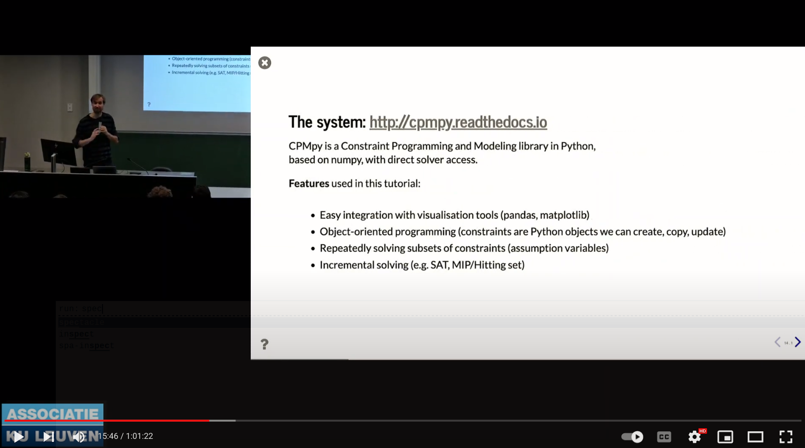

# Explainable Constraint Solving - A Hands-On Tutorial
[](https://doi.org/10.5281/zenodo.10694140)

### Authored by Ignace Bleukx, Dimos Tsouros and Tias Guns

This repository contains the code and runnable notebook for our Explainable Constraint Solving tutorials and talks. 

Explainable constraint solving is a sub-field of explainable AI (XAI) concerned with explaining constraint (optimization) problems. 
Although constraint models are explicit: they are written down in terms of individual constraints that need to be satisfied, and the solution to such models can be non-trivial to understand.

Driven by the use-case of nurse scheduling, we demonstrate the type of questions a user can have about (non)-solutions, as well as reviewing what kind of computational tools are available today to answer such questions. 
We cover classical methods such as MUS/MCS extraction, and more recent advances in the field such as step-wise explanations, constraint relaxation methods, and counterfactual solutions.
We demonstrate and give special attention to techniques that we have successfully (re-)implemented on top of the CPMpy constraint-solving library, which can be readily used today.

The following presentations are available:

* ACP 2024 Winter School lecture: [Notebook](https://github.com/CPMpy/XCP-explain/blob/main/acp24-sumschool-xcp.ipynb) [PDF slides](https://github.com/CPMpy/XCP-explain/blob/main/acp24-sumschool-xcp.slides.pdf) [YouTube video](https://youtu.be/nGr4lbgRvzw)
* CP 2023 tutorial: [Notebook](https://github.com/CPMpy/XCP-explain/blob/main/hands-on-tutorial.ipynb) [HTML slides](https://raw.githack.com/CPMpy/CP23-tutorial/main/hands-on-tutorial.slides.html#/1) [PDF slides](https://github.com/CPMpy/XCP-explain/blob/main/hands-on-tutorial%20slides.pdf) [YouTube video](https://www.youtube.com/watch?v=V9DPHZq0gXk)

The slide-show can be viewed from browser by opening the HTML version and using `Space` to go to the next slide.

Here is the tutorial video for convenience:
[](https://www.youtube.com/watch?v=V9DPHZq0gXk)

## How to run the notebooks?

To run the `.ipynb` yourself, makes sure you install the following packages:
- CPMpy (>= v0.9.17)
- jupyter
- rise (to make the slideshow)
- faker (to create fake names for nurses)
- pandas (for visualizations)
- matplotlib (for visualizations)

A one-liner to install pip-packages:

```bash
pip install cpmpy jupyter nbclassic rise faker pandas matplotlib
```

Optionally, you can install the `Gurobi` MIP solver and the `Exact` ILP solver for better performance of algorithms relying on incremental solving:
Note that for Gurobi, you will need a license in order to make full use of its power.

```bash
pip install gurobipy exact
```

## Structure of the repository
```bash
.
├── Benchmarks                     # Nurse scheduling instances
├── explanations
│   ├── __init__.py
│   ├── counterfactual.py          # Counterfactual explanations [1]
│   ├── marco_mcs_mus.py           # MARCO enumeration algorithm [2]
│   ├── stepwise                   # Fork of the step-wise explanations repo [3]
│   └── subset.py                  # Code to find all kinds of subsets of constraints
├── factory.py                     # Wrapper for nsp
├── hands-on-tutorial slides.pdf   # Exectued version of the slides
├── hands-on-tutorial.ipynb        # Runnable version of the slides
├── hands-on-tutorial.slides.html  # .html version of the executed slides
├── img                            # Images used in the tutorial
├── read_data.py                   # Helper functions to read and wrangle NSP data
└── visualize.py                   # Helper functions for visualization of constraints and solutions
```

## How to cite?
```bibtex
@software{bleukx2024_tutorial,
  author       = {Ignace Bleukx and
                  Guns, Tias and
                  Tsouros, Dimos},
  title        = {{Explainable Constraint Solving: A hands-on 
                   tutorial}},
  month        = feb,
  year         = 2024,
  publisher    = {Zenodo},
  version      = {v1.0},
  doi          = {10.5281/zenodo.10694140},
  url          = {https://doi.org/10.5281/zenodo.10694140}
}
```

## References

> [1] Korikov, A., & Beck, J. C. (2021). Counterfactual explanations via inverse constraint programming. In 27th International Conference on Principles and Practice of Constraint Programming (CP 2021). Schloss Dagstuhl-Leibniz-Zentrum für Informatik.

> [2] Liffiton, M.H., & Malik, A. (2013). Enumerating infeasibility: Finding multiple MUSes quickly. In Proceedings of the 10th International Conference on Integration of AI and OR Techniques in Constraint Programming (CPAIOR 2013) (pp. 160–175)

> [3] Bleukx, I., Devriendt, J., Gamba, E., Bogaerts B., & Guns T. (2023). Simplifying Step-wise Explanation Sequences. In International Conference on Principles and Practice of Constraint Programming 2023
